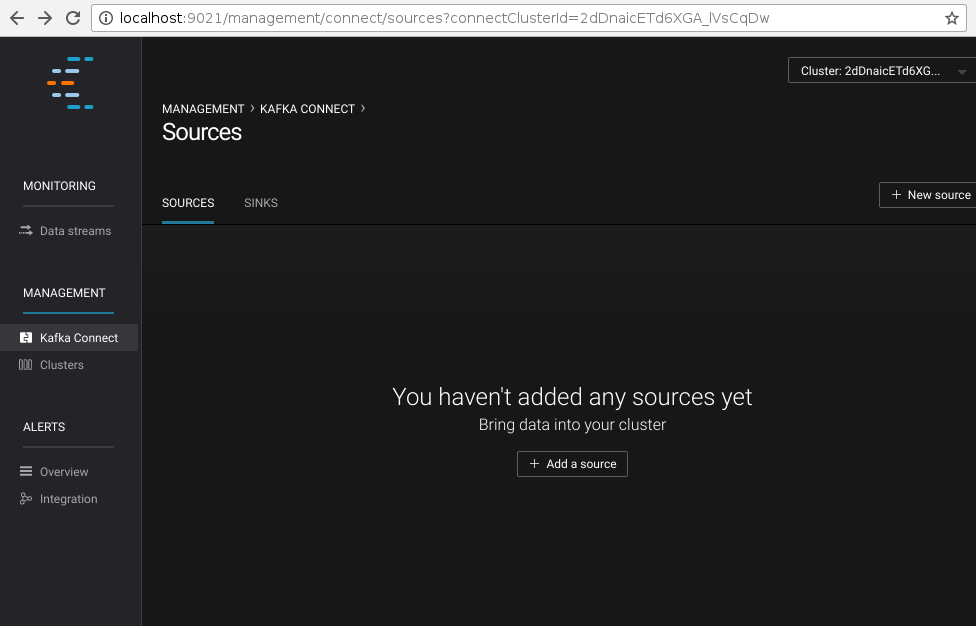
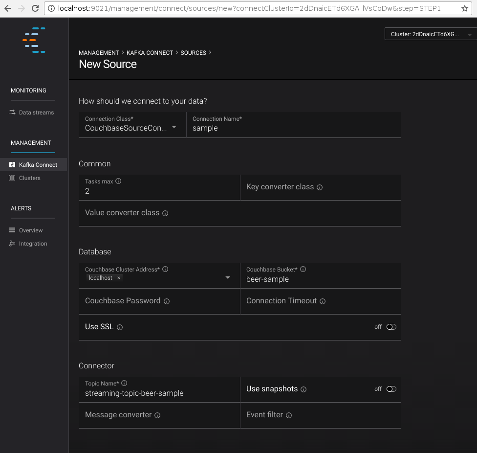

:idprefix:
:idseparator: -

Sample application which uses Couchbase connector with Kafka Streams.

== Prerequisites

This example demonstrates how to build a data pipeline using Kafka to
move data from Couchbase Server to a MySQL database. It assumes a
Couchbase Server instance with the `beer-sample` bucket deployed on
localhost and a MySQL server accessible on its default port (`3306`).
MySQL should also have a `beer_sample_sql` database. The following
snippet describes the schema of the database:

[source,text]
----
DROP DATABASE IF EXISTS beer_sample_sql;
CREATE DATABASE beer_sample_sql CHARACTER SET utf8 COLLATE utf8_general_ci;
USE beer_sample_sql;
CREATE TABLE breweries (
   id VARCHAR(256) NOT NULL,
   name VARCHAR(256),
   description TEXT,
   country VARCHAR(256),
   city VARCHAR(256),
   state VARCHAR(256),
   phone VARCHAR(40),
   updated_at DATETIME,
   PRIMARY KEY (id)
);
CREATE TABLE beers (
   id VARCHAR(256) NOT NULL,
   brewery_id VARCHAR(256) NOT NULL,
   name VARCHAR(256),
   category VARCHAR(256),
   style VARCHAR(256),
   description TEXT,
   abv DECIMAL(10,2),
   ibu DECIMAL(10,2),
   updated_at DATETIME,
   PRIMARY KEY (id)
);
----

This example is built on top of the
http://docs.confluent.io/3.1.1/installation.html[Confluent Platform]
which also installed on localhost, along with the Couchbase connector.
We will use the Confluent
http://docs.confluent.io/3.1.1/control-center/docs/index.html[Control
Center] to configure the link, so make sure this service also is
running. The commands below can be used to start all dependencies:

[source,bash]
----
$ service couchbase-server start
$ service mysql-server start

# For RPM/DEB based Confluent Platform deployments the paths might be absolute.
$ ./bin/zookeeper-server-start ./etc/kafka/zookeeper.properties &
$ ./bin/kafka-server-start ./etc/kafka/server.properties &
$ ./bin/schema-registry-start ./etc/schema-registry/schema-registry.properties &

# Run connect framework in distributed mode
$ ./bin/connect-distributed $CONNECTOR_DIST/config/connect-distributed.properties

$ ./bin/control-center-start etc/confluent-control-center/control-center.properties
----

Note that for the `connect-distributed` script we use the configuration
from the couchbase connector. You can use a stock configuration too, but
make sure that it will use Avro convertors and configure interceptors
for monitoring:

[source,javascript]
----
key.converter=io.confluent.connect.avro.AvroConverter
key.converter.schema.registry.url=http://localhost:8081
value.converter=io.confluent.connect.avro.AvroConverter
value.converter.schema.registry.url=http://localhost:8081
consumer.interceptor.classes=io.confluent.monitoring.clients.interceptor.MonitoringConsumerInterceptor
producer.interceptor.classes=io.confluent.monitoring.clients.interceptor.MonitoringProducerInterceptor
----

== Code Overview

The full code of this sample is accessible in the connector repository
at
https://github.com/couchbase/kafka-connect-couchbase/blob/master/src/test/java/examples/KafkaStreamsDemo.java[src/test/java/examples/KafkaStreamsDemo.java].

[source,java]
----
try {
    Class.forName("com.mysql.jdbc.Driver");
} catch (ClassNotFoundException e) {
    System.err.println("Failed to load MySQL JDBC driver");
}
Connection connection = DriverManager
        .getConnection("jdbc:mysql://localhost:3306/beer_sample_sql", "root", "secret");
final PreparedStatement insertBrewery = connection.prepareStatement(
        "INSERT INTO breweries (id, name, description, country, city, state, phone, updated_at)" +
                " VALUES (?, ?, ?, ?, ?, ?, ?, ?)" +
                " ON DUPLICATE KEY UPDATE" +
                " name=VALUES(name), description=VALUES(description), country=VALUES(country)," +
                " country=VALUES(country), city=VALUES(city), state=VALUES(state)," +
                " phone=VALUES(phone), updated_at=VALUES(updated_at)");
final PreparedStatement insertBeer = connection.prepareStatement(
        "INSERT INTO beers (id, brewery_id, name, description, category, style, abv, ibu, updated_at)" +
                " VALUES (?, ?, ?, ?, ?, ?, ?, ?, ?)" +
                " ON DUPLICATE KEY UPDATE" +
                " brewery_id=VALUES(brewery_id), name=VALUES(name), description=VALUES(description)," +
                " category=VALUES(category), style=VALUES(style), abv=VALUES(abv)," +
                " ibu=VALUES(ibu), updated_at=VALUES(updated_at)");
----

The `main` function of the `KafkaStreamsDemo` class starts with loading
the MySQL driver, establishing connection and preparing insert
statements for both kinds of the documents: `brewery` and `beer`.

[source,java]
----
String schemaRegistryUrl = "http://localhost:8081";
Properties props = new Properties();
props.put(StreamsConfig.APPLICATION_ID_CONFIG, "streams-test");
props.put(StreamsConfig.BOOTSTRAP_SERVERS_CONFIG, "localhost:9092");
props.put(StreamsConfig.ZOOKEEPER_CONNECT_CONFIG, "localhost:2181");
props.put(AbstractKafkaAvroSerDeConfig.SCHEMA_REGISTRY_URL_CONFIG, schemaRegistryUrl);
props.put(StreamsConfig.KEY_SERDE_CLASS_CONFIG, KeyAvroSerde.class);
props.put(StreamsConfig.VALUE_SERDE_CLASS_CONFIG, ValueAvroSerde.class);
props.put(ConsumerConfig.AUTO_OFFSET_RESET_CONFIG, "earliest");
----

The next block supplies the Streams configuration. Along with endpoints,
it sets serializers and deserializers for keys and values, which appear
in the Kafka topics. These values are written by the Couchbase
connector. Here we use simple classes
https://github.com/couchbase/kafka-connect-couchbase/blob/master/src/test/java/examples/serde/KeyAvroSerde.java[src/test/java/examples/serde/KeyAvroSerde.java]
and
https://github.com/couchbase/kafka-connect-couchbase/blob/master/src/test/java/examples/serde/ValueAvroSerde.java[src/test/java/examples/serde/ValueAvroSerde.java],
which do not make assumptions about the document body, but the real
application might implement serdes, working with more specific classes.

[source,java]
----
KStreamBuilder builder = new KStreamBuilder();

KStream<String, GenericRecord> source = builder
        .stream("streaming-topic-beer-sample");
----

We start constructing the source stream by pulling data from the Kafka
topic `streaming-topic-beer-sample`.

[source,java]
----
KStream<String, JsonNode>[] documents = source
        .mapValues(new ValueMapper<GenericRecord, JsonNode>() {
            @Override
            public JsonNode apply(GenericRecord value) {
                ByteBuffer buf = (ByteBuffer) value.get("content");
                try {
                    JsonNode doc = MAPPER.readTree(buf.array());
                    return doc;
                } catch (IOException e) {
                    return null;
                }
            }
        })
        .branch(
                new Predicate<String, JsonNode>() {
                    @Override
                    public boolean test(String key, JsonNode value) {
                        return "beer".equals(value.get("type").asText()) &&
                                value.has("brewery_id") &&
                                value.has("name") &&
                                value.has("description") &&
                                value.has("category") &&
                                value.has("style") &&
                                value.has("abv") &&
                                value.has("ibu") &&
                                value.has("updated");
                    }
                },
                new Predicate<String, JsonNode>() {
                    @Override
                    public boolean test(String key, JsonNode value) {
                        return "brewery".equals(value.get("type").asText()) &&
                                value.has("name") &&
                                value.has("description") &&
                                value.has("country") &&
                                value.has("city") &&
                                value.has("state") &&
                                value.has("phone") &&
                                value.has("updated");
                    }
                }
        );
----

The first step in our pipeline would be to extract `content` from the
Couchbase event and deserialize it as JSON, as Couchbase operates with
JSON documents normally, and in `beer-sample` bucket in particular. With
`branch` operator, we split stream into two by the document type, and in
the same type we filter out documents that don't have all the fields we
want to insert into the MySQL database.

[source,java]
----
documents[0].foreach(new ForeachAction<String, JsonNode>() {
    @Override
    public void apply(String key, JsonNode value) {
        try {
            insertBeer.setString(1, key);
            insertBeer.setString(2, value.get("brewery_id").asText());
            insertBeer.setString(3, value.get("name").asText());
            insertBeer.setString(4, value.get("description").asText());
            insertBeer.setString(5, value.get("category").asText());
            insertBeer.setString(6, value.get("style").asText());
            insertBeer.setBigDecimal(7, new BigDecimal(value.get("abv").asText()));
            insertBeer.setBigDecimal(8, new BigDecimal(value.get("ibu").asText()));
            insertBeer.setDate(9, new Date(DATE_FORMAT.parse(value.get("updated").asText()).getTime()));
            insertBeer.execute();
        } catch (SQLException e) {
            System.err.println("Failed to insert record: " + key + ". " + e);
        } catch (ParseException e) {
            System.err.println("Failed to insert record: " + key + ". " + e);
        }
    }
});
documents[1].foreach(new ForeachAction<String, JsonNode>() {
    @Override
    public void apply(String key, JsonNode value) {
        try {
            insertBrewery.setString(1, key);
            insertBrewery.setString(2, value.get("name").asText());
            insertBrewery.setString(3, value.get("description").asText());
            insertBrewery.setString(4, value.get("country").asText());
            insertBrewery.setString(5, value.get("city").asText());
            insertBrewery.setString(6, value.get("state").asText());
            insertBrewery.setString(7, value.get("phone").asText());
            insertBrewery.setDate(8, new Date(DATE_FORMAT.parse(value.get("updated").asText()).getTime()));
            insertBrewery.execute();
        } catch (SQLException e) {
            System.err.println("Failed to insert record: " + key + ". " + e);
        } catch (ParseException e) {
            System.err.println("Failed to insert record: " + key + ". " + e);
        }
    }
});
----

Once the documents are extracted and filtered we are ready to insert
them into the MySQL database using statements prepared earlier. Note
that inserted records are using the document ID from Couchbase, which
means that records will be updated in place automatically without
creating duplicates. This example does not handle document deletions or
expiration, but it won't be complex to do with an additional stream that
executes `DELETE` statements

[source,java]
----
final KafkaStreams streams = new KafkaStreams(builder, props);
streams.start();
Runtime.getRuntime().addShutdownHook(new Thread(new Runnable() {
    @Override
    public void run() {
        streams.close();
    }
}));
----

The last step is to execute the whole pipeline.

== Running

We start by setting up the connector to relay the bucket contents into
the Kafka topic `streaming-topic-beer-sample`. It could be done either
using property files and `connect-standalone` as in
link:quickstart.html[Quickstart], using REST interface of
`connect-distributed` or using Web UI provided by Control Center. We
will use the last two options.

By default Control Center starts at `http://localhost:9021/`. Connector
configuration is accessible in the "Kafka Connect" section: +
 +

Clicking on "New source" will open the configuration page of connectors.
Specify "Connection Name" as `sample` and "Connection Class" as
`CouchbaseSourceConnector`. Once the connector class is selected, the UI
will render a list of all accessible configuration properties: +
 +

The "Continue" button will lead to the next step where the form values
are converted into JSON, which can be used to define the connector using
the REST API:

[source,bash]
----
$ curl -X POST -H "Content-Type: application/json" http://localhost:8083/connectors \
     --data '{
               "name": "sample",
               "connector.class": "com.couchbase.connect.kafka.CouchbaseSourceConnector",
               "tasks.max": 2,
               "connection.cluster_address": "localhost",
               "connection.bucket": "beer-sample",
               "topic.name": "streaming-topic-beer-sample"
             }'
----

Submitting the form (or using a REST call) will register the new
Connector link and start it immediately.

Now lets pull the sample sources and build them:

[source,bash]
----
$ git clone git://github.com/couchbase/kafka-connect-couchbase
$ cd kafka-connect-couchbase
$ mvn test-compile
$ java -cp ./target/test-classes:$(mvn dependency:build-classpath | grep ^/) \
       examples.KafkaStreamsDemo
----

The records will start filling the `beers` and `breweries` tables.

*Parent topic:* link:kafka-intro.html[Kafka Connector]

*Previous topic:*
link:sink-configuration-options.html[Sink Configuration Options]

*Next topic:* link:release-notes.html[Release Notes]
